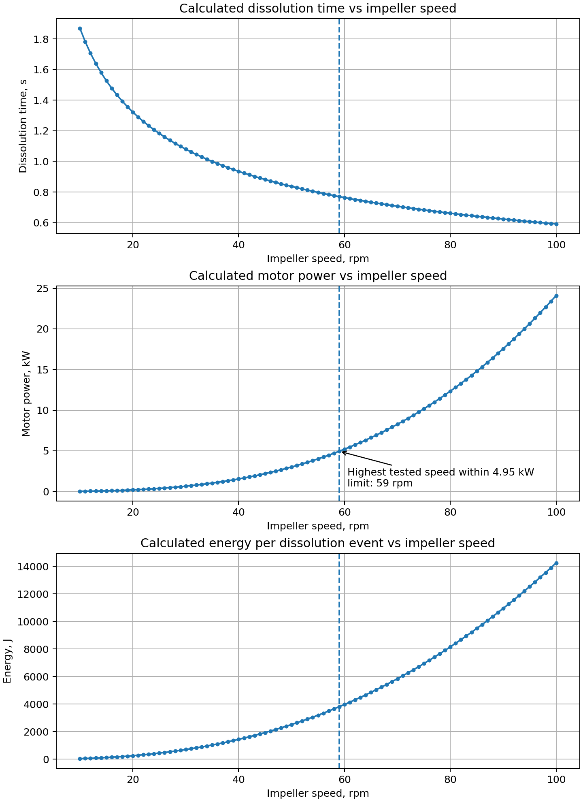

# Salt Dissolution in a Stirred Reactor

A small Python portfolio project that reproduces and documents a theoretical coursework calculation for salt dissolution in a stirred reactor. The model evaluates how impeller speed affects mass transfer, calculated dissolution time, power demand and energy per dissolution event.

> **Scope and integrity note:** This is a transparent implementation of a coursework spreadsheet, not a validated industrial reactor-design or safety tool. It must not be used for equipment sizing, process-control decisions or safety decisions without independent engineering validation.



## Why this project

The original coursework was built in Excel. This repository converts the logic into a reproducible Python model that:

- makes each input and correlation visible;
- produces a reusable calculation table in CSV format;
- generates clear plots of dissolution time, motor power and energy against impeller speed;
- applies a simple motor-capacity screen to identify the highest tested speed within the stated motor limit;
- includes a regression test against the first calculated row in the original workbook.

## Coursework case

The default values reproduce the supplied coursework case for calcium lactate dissolution in water:

| Input | Default value | Unit |
|---|---:|---|
| Concentration driving force, `ΔC` | 44 | kg/m³ |
| Salt density, `ρ_s` | 2265 | kg/m³ |
| Reactor volume, `V` | 63 | m³ |
| Particle diameter, `d_p` | 0.001 | m |
| Tank diameter, `D_t` | 3.2 | m |
| Impeller/tank diameter ratio | 0.40 | — |
| Liquid fill fraction, `φ` | 0.80 | — |
| Liquid density, `ρ_l` | 1010 | kg/m³ |
| Diffusivity, `D` | 2.2 × 10⁻⁹ | m²/s |
| Dynamic viscosity, `μ` | 0.00119 | Pa·s |
| Impeller power coefficient, `K_m` | 0.50 | — |
| Motor factor, `F` | 3.0 | — |
| Motor capacity | 5.0 | kW |

The original workbook labels the diffusivity cell inconsistently. In this implementation it is treated as a molecular diffusivity in **m²/s**, which is required for the Schmidt-number correlation.

## Model equations

The script follows the equations used in the coursework workbook:

```text
n = rpm / 60
Re = n · d_m² · ρ_l / μ
Sc = μ / (ρ_l · D)
Sh = 0.8 · Re^0.5 · Sc^(1/3)
k_c = Sh · D / d_p
τ = ρ_s · (d_p / 2) / (2 · k_c · ΔC)
G = V · φ · ρ_l / τ
N_impeller = K_m · ρ_l · n³ · d_m⁵
N_motor = F · N_impeller
Q = N_motor · τ
```

Where `d_m` is the impeller diameter. The default model scans a speed range from 10 to 100 rpm in 1 rpm increments.

## Repository contents

```text
reactor-dissolution-calculation/
├── dissolution_calculation.py      # Main calculation model and CLI
├── example_config.json             # Editable model inputs
├── requirements.txt                # Python dependency
├── README.md                       # Project documentation
├── tests/
│   └── test_default_case.py        # Regression check vs source spreadsheet
└── example_output/
    ├── dissolution_results.csv     # Example calculation table
    ├── dissolution_plots.png       # Example figures
    └── summary.txt                 # Example run summary
```

## Installation

```bash
git clone <your-repository-url>
cd reactor-dissolution-calculation
python -m venv .venv
```

Activate the environment:

```bash
# Windows PowerShell
.venv\Scripts\Activate.ps1

# macOS / Linux
source .venv/bin/activate
```

Install the dependency:

```bash
pip install -r requirements.txt
```

## Run the default case

```bash
python dissolution_calculation.py --output-dir results
```

The program writes:

- `results/dissolution_results.csv`
- `results/dissolution_plots.png`
- `results/summary.txt`

For the default 5 kW motor-capacity screen, the highest evaluated speed below the limit is **59 rpm**. This is a simple capacity screen, not a universal industrial optimum.

## Use your own inputs

Edit `example_config.json`, then run:

```bash
python dissolution_calculation.py --config example_config.json --min-rpm 10 --max-rpm 100 --step-rpm 1 --output-dir results
```

## Verify the implementation

```bash
python -m unittest discover -s tests
```

The test checks that the 10 rpm result matches the first calculated row in the supplied coursework workbook.

## Limitations

- The equations are reproduced from a theoretical coursework spreadsheet.
- The correlation is used only within the assumptions of the source model.
- The calculated `G` value and other outputs retain the source-workbook logic and labels; they should be interpreted only in the context of the coursework.
- Real equipment design would require validated physical properties, hydrodynamics, solids distribution, impeller geometry, scale-up considerations, materials compatibility and safety analysis.

## Portfolio context

This project demonstrates:

- chemical-process engineering calculations;
- mass-transfer and mixing correlations;
- Excel-to-Python model conversion;
- structured technical documentation;
- data visualization and reproducible engineering analysis.
